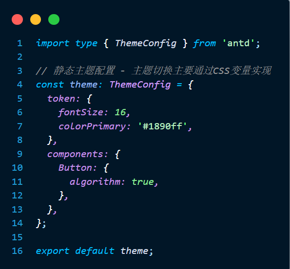
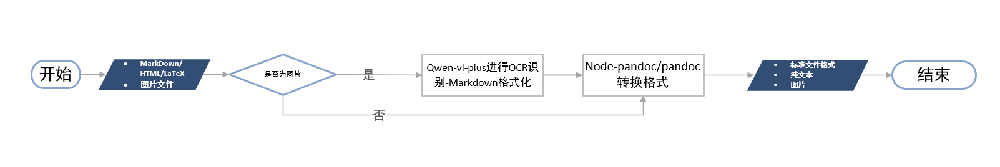
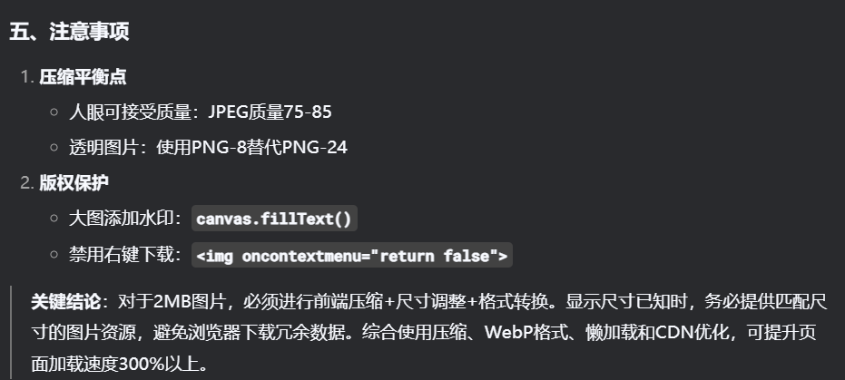
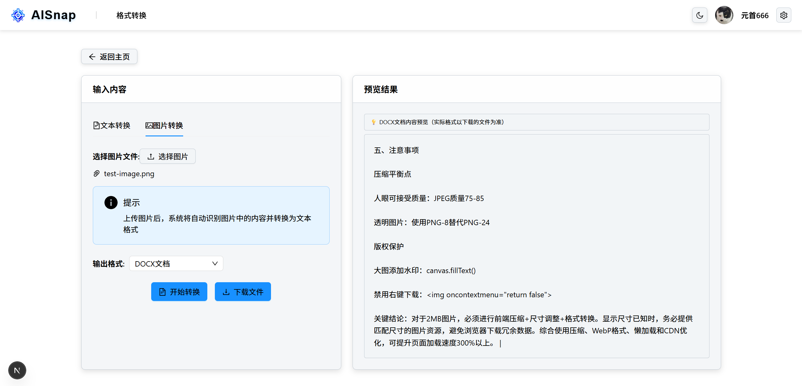
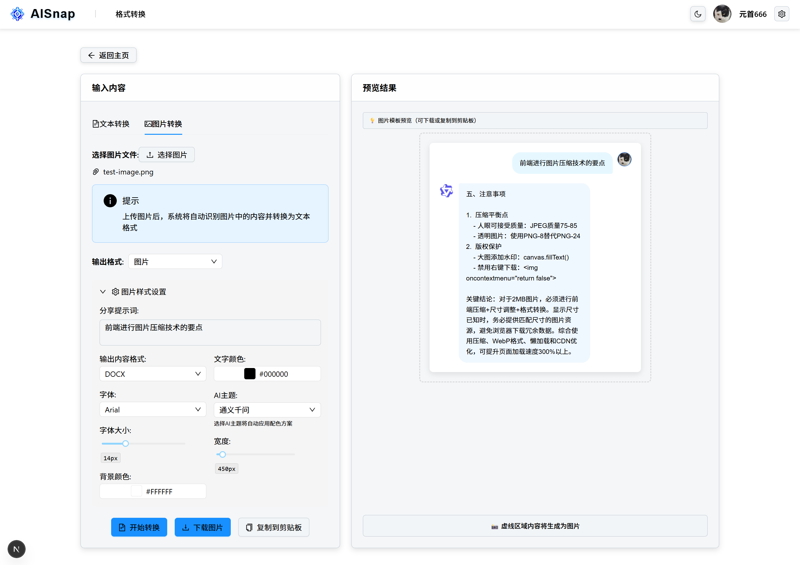
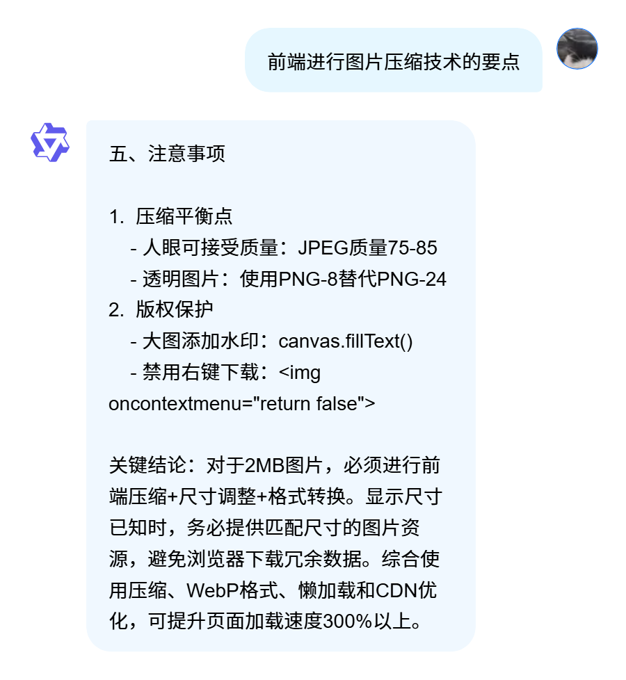
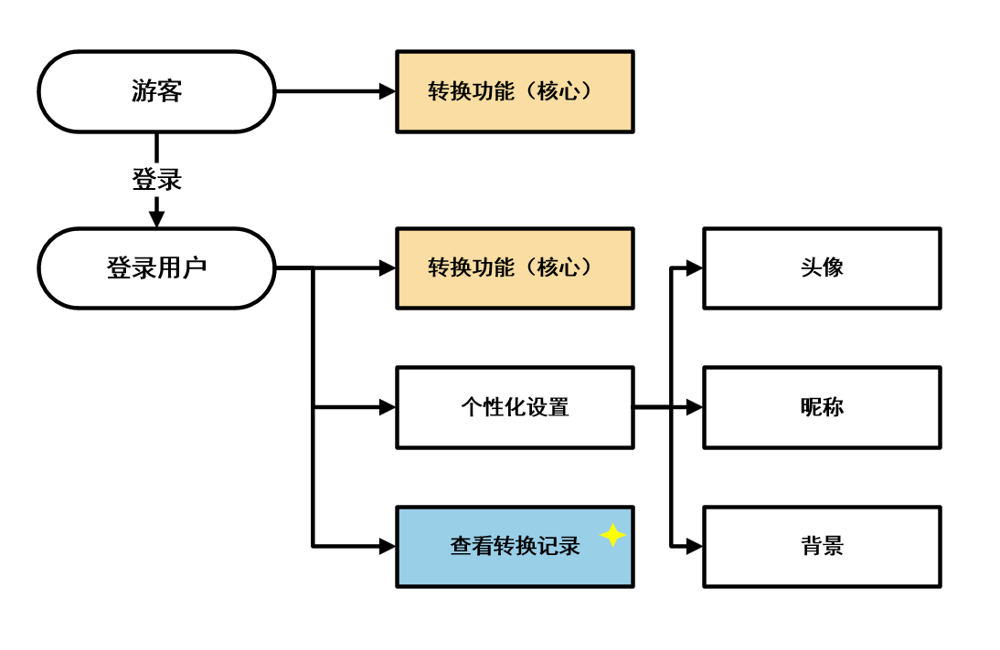
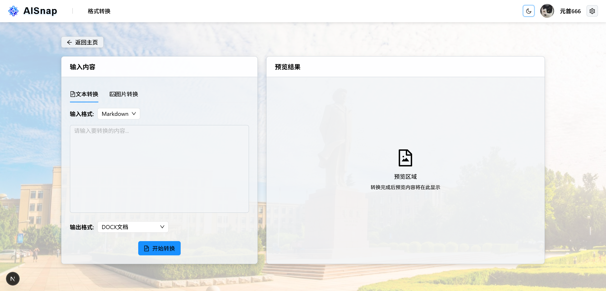
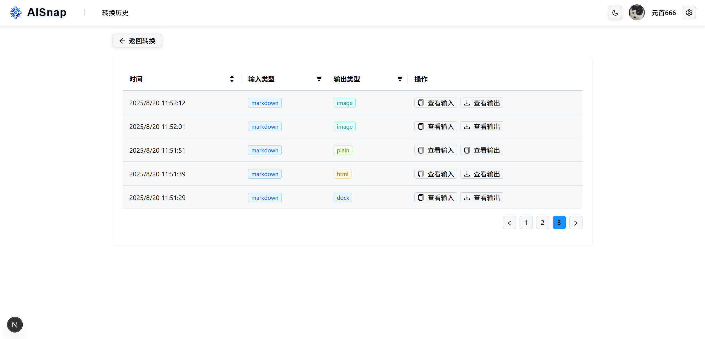
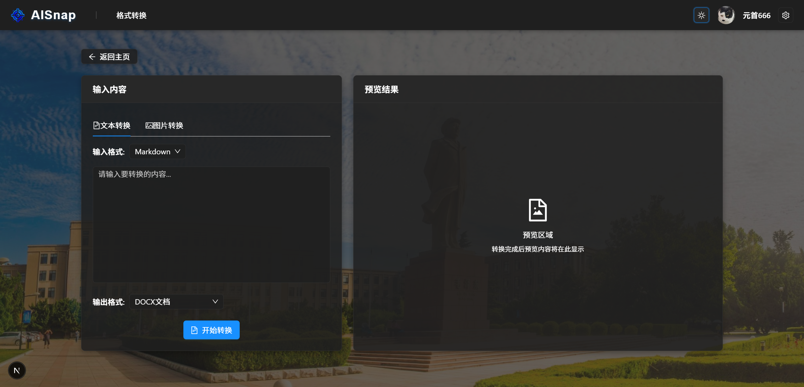

# AISnap AI快照

AISnap——AI快照,智能格式转换平台、便捷分享工具

<!-- PROJECT SHIELDS -->

[![Contributors][contributors-shield]][contributors-url]
[![Forks][forks-shield]][forks-url]
[![Stargazers][stars-shield]][stars-url]
[![Issues][issues-shield]][issues-url]
[![MIT License][license-shield]][license-url]
[![LinkedIn][linkedin-shield]][linkedin-url]

<!-- PROJECT LOGO -->
<br />

<p align="center">
  <a href="https://github.com/ProselyteCoding/aisnap-lingma/">
    
  </a>

  <h3 align="center">AISnap——AI快照,智能格式转换平台、便捷分享工具</h3>
<p align="center">
 
## 目录

- [AISnap AI快照](#aisnap-ai快照)
  - [目录](#目录)
  - [参赛说明](#参赛说明)
  - [项目说明](#项目说明)
    - [项目创意](#项目创意)
    - [项目功能](#项目功能)
    - [项目原理](#项目原理)
  - [开发前的环境要求](#开发前的环境要求)
  - [项目运行](#项目运行)
    - [网站访问](#网站访问)
    - [本地运行](#本地运行)
  - [版权说明](#版权说明)

## 参赛说明

本作品为[大连理工大学第一届Vibe Coding Hackathon“灵码杯”](https://tianchi.aliyun.com/competition/entrance/532398?spm=5176.12281973.J_6-HJZaSjQocH7SIdvbK02.7.5ca03b74yaYv1Z)参赛作品。

所选赛题：**3. 智享生活**

## 项目说明

### 项目创意

当今人们的生活已离不开AI的帮助，无论是生活常识答疑、专业知识求助、文章写作还是用AI编程助手提升开发效率，AI都能提供极大的便利。“调教”下AI生成的一些内容也成为表情包、短视频等互联网文化的一部分。

由此可见，有效利用与分享AI生成的内容成为配合AI技术本身发展的重要方面，我们组发现了当前利用与分享AI生成的内容的一些痛点：AI生成的Markdown文本复制后格式错乱、就算复制成功也仍需删掉大量Markdown语法符号(如`#` `*` `-`)而无法直接使用、想直接截图分享但样式不美观而且也无法清晰体现语境、使用格式转换工具需提交文件会产生大量的临时文件且效率低......

而 [**CodeSnap**](https://codesnap.dev/) 这款代码分享插件则为我们提供了灵感：它可以将代码片段转换为图片并直接分享，且支持多种语言的语法高亮，用户只需运行插件并鼠标选中要分享的代码即可生成图片，且可以复制粘贴进行分享，极大提升了代码分享效率和美观程度。



图1 CodeSnap效果图

为此我们也希望开发一款同类的AI内容分享工具 **AISnap(AI快照)**，实现针对于以上痛点场景的便捷的AI内容转换利用与分享。

### 项目功能

核心功能是实现多格式输入**转换**成多格式输出的快捷功能。输入支持Markdown/HTML/LaTeX文本与图片(AI生成内容的完整截图)，输出支持DOCX/HTML/LaTeX/PDF文件、模板图片、纯文本。输出可进行文件下载与文本复制的一键操作，还提供输出预览功能。



图2 格式转换流程图

图像转换功能是核心功能一个亮点，该功能是指将输入的图片进行识别，再转换成支持的各种输出格式，该技术通过调用通义千问大模型(Qwen-VL)的API接口实现识别功能，实现高准确率、高位置精度(指精准生成对应的空格)的文本识别。



图3 测试用例截图(使用此图作为测试用例进行下图的识别转换生成)



图4 图片转换图

为了达到CodeSnap中生成图片的效果，我们使用HTML2Canvas实现了截图功能，预设了一组精美的模板，即允许用户体现AI身份也可以添加用户prompt，是使语境更完备，一键下载与复制真正实现了如CodeSnap中的快捷分享。



图5 模板图片生成图



图6 生成的模板图片

---

我们还充分考虑到现代化应用的开发与用户的个性化需求，将用户分为登录用户与游客两种类型，建立起完备的用户管理系统。所有用户都可以使用核心转换功能，而登录用户则可以个性化设置头像、背景、昵称等用户信息，并可以查看自己的转换历史记录。



图7 用户权限图



图8 个性化设置演示图



图9 转换历史演示图

为了有更良好的用户浏览体验，我们还设计并适配了暗色主题，用户可以从导航栏中一键切换。



图10 暗色主题演示图

### 项目原理

核心转换原理为 [Pandoc](https://pandoc.org/) (或node-pandoc)这一工具的文本转换功能，该工具也被称为格式转换的“瑞士军刀”，支持Markdown、HTML、LaTeX、DOCX、PDF等多种格式的转换。但该工具为命令行工具，可视化程度低，上手难度较高，且更多是文件的转换，会产生临时文件、效率低。本项目充分利用其优势并结合前端技术实现了文件内容上的多个接口，可实现更多复制粘贴与内容提取的快捷功能，提升效率、贴近生活。

图片生成原理为 [HTML2Canvas](https://html2canvas.hertzen.com/) 库，该库可以将HTML元素渲染为Canvas并生成图片，实现高质量截图功能，既能避免浏览器截图权限问题又能生成高质量的截图图片。实际上配合预设CSS样式实现生成美观的模板图片，便于分享。

图像识别原理为接入了阿里的通义千问模型的API接口，使用模型为 Qwen-VL 的图像识别功能，支持高准确率的文本识别与位置精度，能够将图片中的文本内容转换为可编辑的文本格式。

## 开发前的环境要求

1. Node
2. pandoc（转换功能所必需，可通过下文安装步骤进行安装）

## 项目运行

注意：本项目虽做了移动端适配，但更多针对PC端场景，请优先使用PC端运行。

### 网站访问

通过IP地址 http://47.94.198.49/ 或域名 https://www.lianliestation.xin/ 访问。

若无法访问请及时联系或尝试下面的本地运行。

### 本地运行

以下为本地安装运行步骤：

1. 安装pandoc环境

  ```sh
  yum install -y pandoc
  ```

  安装后可通过 `npm pandoc -v` 检查是否安装成功。

2. 克隆项目到本地：
  ```sh
  git clone https://github.com/ProselyteCoding/aisnap-lingma.git
  cd aisnap-lingma/aisnap
  ```

3. 安装依赖：
  ```sh
  npm install
  ```

4. 配置环境变量：
  根据 `.env.example` 环境变量示例文件编写 `.env` 文件，并根据实际情况填写数据库等配置。

  ```sh
  cp .env.example .env
  # 或手动新建 .env 文件
  ```

5. 初始化数据库：
  ```sh
  npx prisma migrate dev
  # 或 npx prisma db push
  ```

6. 启动开发服务器：
  ```sh
  npm run dev
  ```

7. 访问本地项目：
  在浏览器中打开 http://localhost:3000

## 版权说明

该项目签署了MIT 授权许可，详情请参阅 [LICENSE.txt](https://github.com/ProselyteCoding/aisnap-lingma/blob/master/LICENSE.txt)

<!-- links -->
[your-project-path]:ProselyteCoding/aisnap-lingma
[contributors-shield]: https://img.shields.io/github/contributors/ProselyteCoding/aisnap-lingma.svg?style=flat-square
[contributors-url]: https://github.com/ProselyteCoding/aisnap-lingma/graphs/contributors
[forks-shield]: https://img.shields.io/github/forks/ProselyteCoding/aisnap-lingma.svg?style=flat-square
[forks-url]: https://github.com/ProselyteCoding/aisnap-lingma/network/members
[stars-shield]: https://img.shields.io/github/stars/ProselyteCoding/aisnap-lingma.svg?style=flat-square
[stars-url]: https://github.com/ProselyteCoding/aisnap-lingma/stargazers
[issues-shield]: https://img.shields.io/github/issues/ProselyteCoding/aisnap-lingma.svg?style=flat-square
[issues-url]: https://img.shields.io/github/issues/ProselyteCoding/aisnap-lingma.svg
[license-shield]: https://img.shields.io/github/license/ProselyteCoding/aisnap-lingma.svg?style=flat-square
[license-url]: https://github.com/ProselyteCoding/aisnap-lingma/blob/master/LICENSE.txt
[linkedin-shield]: https://img.shields.io/badge/-LinkedIn-black.svg?style=flat-square&logo=linkedin&colorB=555
[linkedin-url]: https://linkedin.com/in/ProselyteCoding